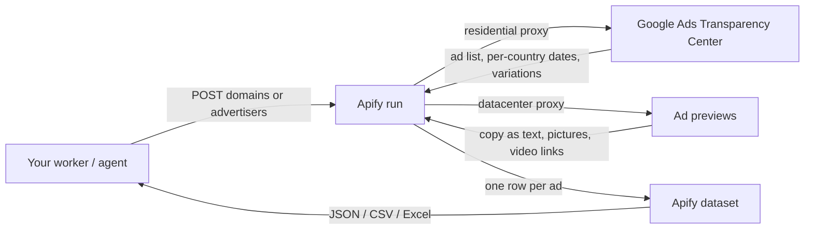

# Google Ads Transparency Center Scraper Docs

[](https://apify.com/agnes.developer.queen/google-ads-transparency-scraper)
[](LICENSE)

Consumer documentation and examples for the Google Ads Transparency Center Scraper actor on Apify. Domains or advertiser names in, one row per ad out: text, image and video creatives, first and last shown dates, countries. Pay per ad.

The actor lives on Apify Store: https://apify.com/agnes.developer.queen/google-ads-transparency-scraper

This repo contains documentation, the input and output shape, and integration examples in curl, Node and Python. The actor source itself is not in this repo. Use this README to wire the actor into your code.

## What it does

You send a list of website domains or advertiser names. The actor reads the public Google Ads Transparency Center and returns every ad Google lists for each advertiser: the creative (ad copy as text where Google publishes it, a picture of every variation, the YouTube link for video ads, the product photo and merchant for shopping ads), when the ad first and last ran, and the countries it ran in with per-country dates and Google's times-shown ranges.

No login, no cookies. Run it once for research, or turn on monitor mode and schedule it to get only the ads a competitor launched since your last run.

Not returned, because Google does not publish it: spend, budgets, keywords, bids, targeting, clicks or conversions.

## Architecture



## Request flow

```mermaid
sequenceDiagram
    participant App as Your App
    participant API as Apify API
    participant Actor as Ads Transparency Actor
    participant Google as Google Ads Transparency Center
    App->>API: POST /acts/.../run-sync-get-dataset-items
    API->>Actor: Start run
    Actor->>Google: Resolve domain or name to advertiser ID
    Actor->>Google: Page through the advertiser's ads
    Actor->>Google: Fetch per-country dates and variations for each ad
    Actor->>Google: Fetch the ad preview (copy, pictures, video link)
    Actor->>Actor: Charge one "ad" event per row with content
    Actor-->>API: Rows pushed to the dataset
    API-->>App: Array of ad records
```

## Input

From the actor's input schema.

| Field | Type | Default | Meaning |
|---|---|---|---|
| `domains` | array of strings | | Advertiser websites, for example `nike.com`. Returns the ads Google shows for that domain. Up to 100 |
| `advertisers` | array of strings | | Optional. Advertiser names exactly as Google verified them (Inc or LLC can be left off), or Transparency Center advertiser IDs that start with `AR`. When several advertisers share a name, the largest one and same-name accounts in its country are used, and the run log lists the others with their IDs. Up to 100 |
| `region` | string | `anywhere` | Two-letter country code such as `US`, `GB` or `DE`. Only ads shown in that country are delivered. `anywhere` for all countries |
| `format` | string | `all` | `all`, `text`, `image` or `video` |
| `maxAdsPerAdvertiser` | integer | `50` | Stop after this many ads for each domain or advertiser. 1 to 1,000. Only ads with IDs, dates and content are charged |
| `onlyNewSinceLastRun` | boolean | `false` | Monitor mode. The first run delivers current ads up to your limit and remembers every ad it saw. Later runs of the same search deliver only ads that appeared since. Schedule it daily or weekly |
| `proxyConfiguration` | object | Apify residential | Proxy for the Transparency Center search calls. Residential keeps Google's rate limit away and these calls are small. Ad previews always use datacenter proxy |

Example input:

```json
{
  "domains": ["nike.com"],
  "region": "anywhere",
  "maxAdsPerAdvertiser": 20,
  "proxyConfiguration": { "useApifyProxy": true, "apifyProxyGroups": ["RESIDENTIAL"] }
}
```

## Output shape

Each dataset row is one ad. The record below is one real row from a nike.com run (20 ads requested, 19 delivered with content and charged). The `countries` list is cut to 4 of its 13 entries, and `previewUrl` is left out because it is a long Google URL. Every row has both.

```json
{
    "advertiserName": "Nike Retail BV",
    "advertiserId": "AR18378488041124659201",
    "domain": "nike.com",
    "creativeId": "CR17279215814825738241",
    "format": "text",
    "adType": "search",
    "headline": "Nike Basketball Shoes",
    "description": "Discover Nike Shoes Online At Nike.com. Shop The Official Nike Site.",
    "displayUrl": "nike.com",
    "sitelinks": [],
    "imageUrl": "https://tpc.googlesyndication.com/archive/simgad/10990147604733979610",
    "variations": [
        "https://tpc.googlesyndication.com/archive/simgad/10990147604733979610"
    ],
    "videoUrl": null,
    "merchant": null,
    "firstShown": "2025-10-24",
    "lastShown": "2026-09-23",
    "daysShown": 334,
    "countries": [
        { "country": "DE", "firstShown": "2025-10-24", "lastShown": "2026-09-23", "timesShownLow": 6000, "timesShownHigh": 7000 },
        { "country": "NL", "firstShown": "2025-10-24", "lastShown": "2026-09-23", "timesShownLow": 50000, "timesShownHigh": 60000 },
        { "country": "BE", "firstShown": "2025-10-25", "lastShown": "2026-09-23", "timesShownLow": 7000, "timesShownHigh": 8000 },
        { "country": "FR", "firstShown": "2025-11-05", "lastShown": "2026-09-08", "timesShownLow": null, "timesShownHigh": 1000 }
    ],
    "transparencyUrl": "https://adstransparency.google.com/advertiser/AR18378488041124659201/creative/CR17279215814825738241",
    "isNew": null,
    "charged": true,
    "reason": "ad with content and dates",
    "scrapedAt": "2026-09-23T22:44:30.181Z"
}
```

| Field | What it is |
|---|---|
| `advertiserName`, `advertiserId` | The advertiser as Google verified it, and its Transparency Center ID |
| `domain` | The advertiser's website |
| `creativeId` | The ad's ID in the Transparency Center |
| `format`, `adType` | `text`, `image` or `video`, and `search`, `shopping`, `image`, `video` or `text` |
| `headline`, `description`, `displayUrl`, `sitelinks` | The ad copy as text, when Google publishes it as text |
| `imageUrl` | A picture of the ad: the creative for image ads, Google's rendering for text ads, the product photo for shopping ads |
| `variations` | Google's rendered picture of each variation of the ad |
| `videoUrl` | YouTube link of a video ad when Google embeds one |
| `merchant` | Merchant name on shopping ads |
| `firstShown`, `lastShown`, `daysShown` | When the ad ran and for how many days |
| `countries` | Each country with its own first and last shown date, plus Google's times-shown range where Google publishes one |
| `transparencyUrl`, `previewUrl` | Links to the ad in the Transparency Center |
| `isNew` | In monitor mode, `true` when the ad is new since your last run |
| `charged`, `reason` | Whether the row was charged, and why |
| `scrapedAt` | When the row was collected, ISO 8601 |

## Pricing

Pay per event. No subscription, no monthly minimum.

| Event | Price | When you pay |
|---|---|---|
| Actor start | $0.00005 | Once per run |
| Ad | $0.0025 | An ad is delivered with its IDs, its shown dates and its content (text, picture or video) |

1,000 ads cost 1,000 x $0.0025 = $2.50, plus $0.00005 for the run start.

Rows without usable content (usually rich display ads that only render inside Google's player) are still delivered with `charged: false` and cost $0. In monitor mode you pay only for ads that are new since your last run. Apify platform usage (compute, proxy) is billed separately by Apify as with any actor.

## Use cases

1. Competitor ad monitoring. Schedule monitor mode weekly on ten competitors and get only the new ads.
2. Agency pitches. Pull every search ad a prospect's rivals ran last month and open the pitch with their copy.
3. Creative research. Build a swipe file of a category's ads with the picture of every variation, sorted by `daysShown` to find the ads that kept running.
4. Brand safety. Check which advertisers run ads on your brand's domain or name, and in which countries.
5. Market entry research. Set `region` to a new country and see who advertises there and what they say.

## Examples

See [examples/curl.sh](examples/curl.sh), [examples/node.js](examples/node.js), [examples/python.py](examples/python.py) for working consumer-side snippets that call the public Apify API. Each one starts a run, waits for it to finish and prints the ads.

A run with 20 ads usually finishes well inside the 300-second `run-sync` limit. For larger limits or many domains, start the run with `POST /v2/acts/agnes.developer.queen~google-ads-transparency-scraper/runs` and read the dataset when it finishes, or use the [apify-client](https://docs.apify.com/api/client) library's `.call()` which waits for you.

Make, n8n and Zapier: use the Apify app or node, pick "Run Actor", choose `agnes.developer.queen/google-ads-transparency-scraper` and paste the input JSON. MCP clients can use `https://mcp.apify.com/?tools=agnes.developer.queen/google-ads-transparency-scraper`.

## Authentication

You need an Apify API token. Get one at https://console.apify.com/account/integrations.

Set it as an environment variable:

```
APIFY_TOKEN=apify_api_xxxxxxxxxxxxxxxxxxxxx
```

The examples in this repo read from `APIFY_TOKEN`.

## Related actors

Pay-per-result scrapers by the same author, all without login:

- [LinkedIn People Search Scraper](https://apify.com/agnes.developer.queen/linkedin-people-search-scraper) - people by title, company and location
- [LinkedIn Ad Library Scraper](https://apify.com/agnes.developer.queen/linkedin-ad-library-scraper) - competitor ads, creatives, impressions by country
- [LinkedIn Jobs Scraper](https://apify.com/agnes.developer.queen/linkedin-jobs-scraper) - full job descriptions and a new-jobs monitor
- [LinkedIn Company Scraper](https://apify.com/agnes.developer.queen/linkedin-company-scraper) - industry, size, HQ, followers

Index of all of them: https://github.com/agnesthedeveloper/agnes-apify-actors

## License

MIT, see [LICENSE](LICENSE).

The actor source is hosted on Apify and is not included in this repo. This repo is for consumer documentation and examples only.
